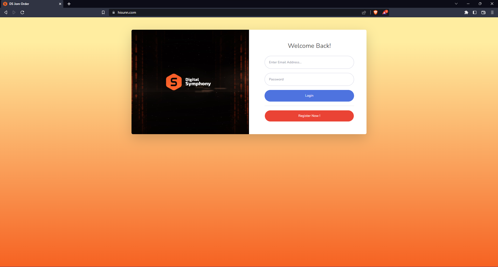
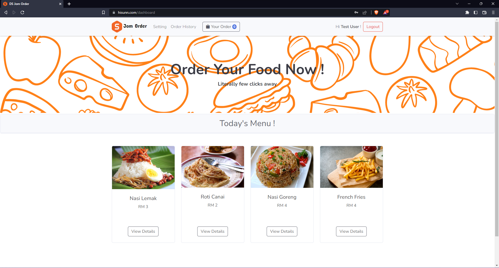
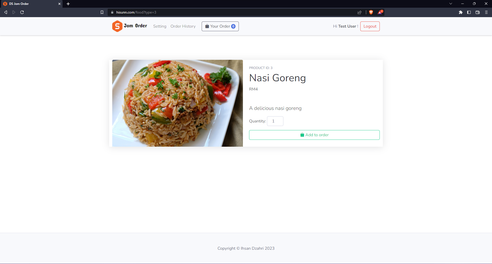

  <h1 align="center">Simple Food Ordering System</h1>  
  

    A simple food ordering system developed using laravel framework
     
     
    <a href="https://hisunn.com/">View Demo (Active until 27/2/2024)</a>  
  

asdasd

## How to run system (locally)

1. Clone this project and export db sql inside database/sql 
2. Go to the folder application using cd command on your cmd or terminal
3. Run composer install on your cmd or terminal
4. Copy .env.example file to .env on the root folder
5. Open your .env file and change the database name (DB_DATABASE) to whatever you have, username (DB_USERNAME) and password (DB_PASSWORD) field correspond to your configuration
6. Run php artisan key:generate on terminal/cmd
7. Run php artisan migrate on terminal/cmd
8. Run php artisan serve on terminal/cmd
9. Recommended using laragon to setup as the system is built with it

### Built With

This project is built with a different kind of tools. Here's the list of the one I used to create this system.

* [![Laragon][Laragon.com]][Laragon-url]
* [![Laravel][Laravel.com]][Laravel-url]
* [![Php][Php.net]][Php-url]
* [![JQuery][JQuery.com]][JQuery-url]
* [![Bootstrap][Bootstrap.com]][Bootstrap-url]
* [![Startbootstrap][Startbootstrap.com]][Startbootstrap-url]

## Snapshot of System

## Contact
Hit me up !

Ihsan Dzahri - [@hisunn](https://github.com/hisunn) 

Project Link: [https://github.com/hisunn/DigitalSymphony](https://github.com/hisunn/DigitalSymphony)

(<a href="#top">back to top</a>)

[Laragon.com]:https://img.shields.io/badge/Laragon-36a4ff?style=for-the-badge&logo=Laragon&logoColor=white
[Laragon-url]:https://laragon.org/
[Laravel.com]:https://img.shields.io/badge/Laravel-f32b1f?style=for-the-badge&logo=Laravel&logoColor=white
[Laravel-url]:https://laravel.com/
[Bootstrap.com]: https://img.shields.io/badge/Bootstrap-563D7C?style=for-the-badge&logo=bootstrap&logoColor=white
[Bootstrap-url]: https://getbootstrap.com
[Startbootstrap.com]: https://img.shields.io/badge/Startbootstrap-dc3d30?style=for-the-badge&logo=bootstrap&logoColor=white
[Startbootstrap-url]: https://startbootstrap.com/
[JQuery.com]: https://img.shields.io/badge/jQuery-0769AD?style=for-the-badge&logo=jquery&logoColor=white
[JQuery-url]: https://jquery.com
[Php.net]:https://img.shields.io/badge/PHP-697AB1?style=for-the-badge&logo=Php&logoColor=white
[Php-url]:https://www.php.net/
