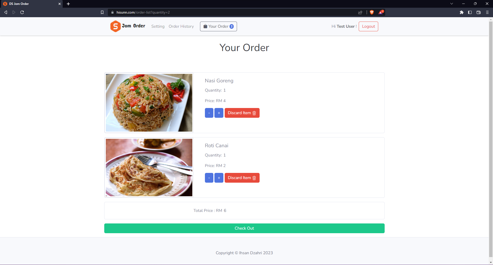

  <h3 align="center">Simple Food Ordering System</h3>
  

    A simple food ordering system developed using laravel framework
     
     
    <a href="https://hisunn.com/">View Demo (Active until 27/2/2024)</a>  
  

## How to run system (locally)

1. Clone this project and export db sql inside database/sql 
2. Go to the folder application using cd command on your cmd or terminal
3. Run composer install on your cmd or terminal
4. Copy .env.example file to .env on the root folder
5. Open your .env file and change the database name (DB_DATABASE) to whatever you have, username (DB_USERNAME) and password (DB_PASSWORD) field correspond to your configuration
6. Run php artisan key:generate on terminal/cmd
7. Run php artisan migrate on terminal/cmd
8. Run php artisan serve on terminal/cmd

### Known bugs 
- visual bug after clicking to 'your order' page directly after add order (FIXED)

### Built With

This project is built with a different kind of tools. Here's the list of the one I used to create this system.

* [![Laragon][Laragon.com]][Laragon-url]
* [![Laravel][Laravel.com]][Laravel-url]
* [![Php][Php.net]][Php-url]
* [![JQuery][JQuery.com]][JQuery-url]
* [![Bootstrap][Bootstrap.com]][Bootstrap-url]

<!-- 
## Snapshot of System

--!>

## About Laravel

Laravel is a web application framework with expressive, elegant syntax. We believe development must be an enjoyable and creative experience to be truly fulfilling. Laravel takes the pain out of development by easing common tasks used in many web projects, such as:

- [Simple, fast routing engine](https://laravel.com/docs/routing).
- [Powerful dependency injection container](https://laravel.com/docs/container).
- Multiple back-ends for [session](https://laravel.com/docs/session) and [cache](https://laravel.com/docs/cache) storage.
- Expressive, intuitive [database ORM](https://laravel.com/docs/eloquent).
- Database agnostic [schema migrations](https://laravel.com/docs/migrations).
- [Robust background job processing](https://laravel.com/docs/queues).
- [Real-time event broadcasting](https://laravel.com/docs/broadcasting).

Laravel is accessible, powerful, and provides tools required for large, robust applications.

## Learning Laravel

Laravel has the most extensive and thorough [documentation](https://laravel.com/docs) and video tutorial library of all modern web application frameworks, making it a breeze to get started with the framework.

If you don't feel like reading, [Laracasts](https://laracasts.com) can help. Laracasts contains over 1500 video tutorials on a range of topics including Laravel, modern PHP, unit testing, and JavaScript. Boost your skills by digging into our comprehensive video library.

## Laravel Sponsors

We would like to extend our thanks to the following sponsors for funding Laravel development. If you are interested in becoming a sponsor, please visit the Laravel [Patreon page](https://patreon.com/taylorotwell).

### Premium Partners

- **[Vehikl](https://vehikl.com/)**
- **[Tighten Co.](https://tighten.co)**
- **[Kirschbaum Development Group](https://kirschbaumdevelopment.com)**
- **[64 Robots](https://64robots.com)**
- **[Cubet Techno Labs](https://cubettech.com)**
- **[Cyber-Duck](https://cyber-duck.co.uk)**
- **[Many](https://www.many.co.uk)**
- **[Webdock, Fast VPS Hosting](https://www.webdock.io/en)**
- **[DevSquad](https://devsquad.com)**
- **[Curotec](https://www.curotec.com/services/technologies/laravel/)**
- **[OP.GG](https://op.gg)**
- **[WebReinvent](https://webreinvent.com/?utm_source=laravel&utm_medium=github&utm_campaign=patreon-sponsors)**
- **[Lendio](https://lendio.com)**

## Contributing

Thank you for considering contributing to the Laravel framework! The contribution guide can be found in the [Laravel documentation](https://laravel.com/docs/contributions).

## Code of Conduct

In order to ensure that the Laravel community is welcoming to all, please review and abide by the [Code of Conduct](https://laravel.com/docs/contributions#code-of-conduct).

## Security Vulnerabilities

If you discover a security vulnerability within Laravel, please send an e-mail to Taylor Otwell via [taylor@laravel.com](mailto:taylor@laravel.com). All security vulnerabilities will be promptly addressed.

## License

The Laravel framework is open-sourced software licensed under the [MIT license](https://opensource.org/licenses/MIT).

[Laragon.com]:https://img.shields.io/badge/Laragon-36a4ff?style=for-the-badge&logo=Laragon&logoColor=white
[Laragon-url]:https://laragon.org/
[Laravel.com]:https://img.shields.io/badge/Laravel-f32b1f?style=for-the-badge&logo=Laravel&logoColor=white
[Laravel-url]:https://laravel.com/
[Bootstrap.com]: https://img.shields.io/badge/Bootstrap-563D7C?style=for-the-badge&logo=bootstrap&logoColor=white
[Bootstrap-url]: https://getbootstrap.com
[JQuery.com]: https://img.shields.io/badge/jQuery-0769AD?style=for-the-badge&logo=jquery&logoColor=white
[JQuery-url]: https://jquery.com
[Php.net]:https://img.shields.io/badge/PHP-697AB1?style=for-the-badge&logo=Php&logoColor=white
[Php-url]:https://www.php.net/
